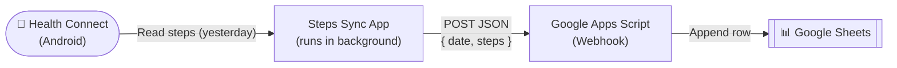

# Steps Sync

An Android app that automatically reads your daily step count from **Health Connect** and sends it to a **Google Sheet** via a Google Apps Script webhook — no manual input needed.

---

## How it works



1. **Health Connect** stores your step data from your phone or wearable.
2. The **Steps Sync app** runs a background job every 24 hours (even when closed).
3. It reads yesterday's total steps (the last fully completed day) and POSTs them to your webhook.
4. The **Google Apps Script** receives the data and appends a row to your Google Sheet.

---

## Requirements

- Android 9 (API 26) or higher
- [Health Connect](https://play.google.com/store/apps/details?id=com.google.android.apps.healthdata) installed (built-in on Android 14+)
- A step-tracking source connected to Health Connect (Google Fit, Samsung Health, Fitbit, etc.)
- A Google Sheet with a Google Apps Script webhook deployed as a web app

---

## Setup

### 1. Deploy the Google Apps Script webhook

In your Google Sheet, go to **Extensions → Apps Script** and paste this script:

```javascript
function doPost(e) {
  const data = JSON.parse(e.postData.contents);
  const sheet = SpreadsheetApp.getActiveSpreadsheet().getActiveSheet();
  sheet.appendRow([data.date, data.steps, new Date()]);
  return ContentService.createTextOutput("OK");
}
```

Click **Deploy → New deployment → Web app**, set access to **"Anyone"**, and copy the generated URL.

### 2. Configure your webhook URL

Add the URL to your `local.properties` file (this file is **never committed to git**):

```properties
sdk.dir=/path/to/your/Android/sdk
webhook_url=https://script.google.com/macros/s/YOUR_SCRIPT_ID/exec
```

### 3. Build the APK

```bash
# Make sure Java 17 is available
export JAVA_HOME=/opt/homebrew/opt/openjdk@17/libexec/openjdk.jdk/Contents/Home
export PATH="$JAVA_HOME/bin:$PATH"

./gradlew assembleDebug
```

The APK will be at:
```
app/build/outputs/apk/debug/app-debug.apk
```

### 4. Install on your device

```bash
adb install app/build/outputs/apk/debug/app-debug.apk
```

Or transfer the APK file directly to your phone.

### 5. Grant permissions

Open the app and tap **"Conceder permiso"**. This opens Health Connect's permission screen — allow Steps Sync to read your step data.

That's it. The app will sync automatically every day.

---

## Project structure

```
app/src/main/kotlin/com/stepssync/
├── app/
│   ├── MainActivity.kt        # Permission UI and manual sync trigger
│   └── MainApplication.kt     # Schedules the daily background worker
├── config/
│   └── Constants.kt           # App-wide constants (webhook URL injected at build time)
├── data/
│   ├── HealthConnectRepository.kt  # Reads steps from Health Connect
│   └── SyncStateStore.kt          # Prevents duplicate syncs
├── network/
│   └── ApiClient.kt           # Sends step data to the webhook
└── sync/
    └── SyncWorker.kt          # Background worker (runs every 24h)
```

---

## Security

- The webhook URL is **never stored in the source code**. It is read from `local.properties` at build time and injected as a `BuildConfig` field — meaning it lives only inside the compiled APK, not in the repository.
- `local.properties` is listed in `.gitignore` and will never be committed.
- The app only requests the `READ_STEPS` permission from Health Connect — no write access, no location, no other data.
- All network requests use HTTPS.

---

## Tech stack

| Component | Library |
|---|---|
| Background sync | AndroidX WorkManager |
| Health data | Health Connect (`androidx.health.connect`) |
| HTTP client | OkHttp 4 |
| Async | Kotlin Coroutines |
| Min Android | API 26 (Android 9) |

Android app minimalista tipo daemon para sincronizar un resumen diario de pasos desde Health Connect hacia un Google Apps Script mediante `HTTP POST`.

## Arquitectura

```text
app
├── app/MainApplication       -> programa WorkManager único cada 24h
├── app/MainActivity          -> pantalla mínima solo para conceder permisos
├── data/HealthConnectRepository -> agrega StepsRecord.COUNT_TOTAL del último día completo
├── data/SyncStateStore       -> evita duplicados por fecha con SharedPreferences
├── network/ApiClient         -> envía { date, steps } al webhook
└── sync/SyncWorker           -> orquesta lectura + POST + control de errores
```

## Configuración clave

- Webhook fijo en `app/src/main/kotlin/com/stepssync/config/Constants.kt`
- Payload enviado:

```json
{
  "date": "YYYY-MM-DD",
  "steps": 1234
}
```

## Cómo probar

1. Instala Health Connect en el dispositivo si no está disponible.
2. Instala la app y ábrela una vez.
3. Concede el permiso de lectura de pasos.
4. Verifica en `adb logcat -s MainApplication SyncWorker MainActivity` que el worker quede programado.
5. Espera la ejecución periódica de WorkManager o fuerza una ejecución desde Android Studio / WorkManager Inspector si está disponible.

## Checklist de errores típicos

- Health Connect no instalado o desactualizado.
- Permiso `READ_STEPS` no concedido.
- El webhook de Apps Script no está desplegado como `/exec` público.
- Sin conectividad de red en la ventana de ejecución del worker.
- Datos de pasos vacíos porque el último día completo todavía no tiene registros.
- WorkManager no ejecuta exactamente a una hora fija: Android puede diferir la tarea dentro de su ventana.

## Validación local esperada

- `./gradlew lintDebug`
- `./gradlew testDebugUnitTest`
- `./gradlew assembleDebug`

En este entorno no fue posible descargar dependencias de Android/Google para ejecutar el build completo.
