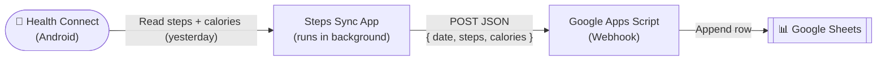

# Steps Sync

An Android app that automatically reads your daily step count and calories burned from **Health Connect** and sends them to a **Google Sheet** via a Google Apps Script webhook — no manual input needed.

---

## How it works



1. **Health Connect** stores your step and calorie data from your phone or wearable.
2. The **Steps Sync app** runs a background job every 24 hours (even when closed).
3. It reads yesterday's totals (the last fully completed day) and POSTs them to your webhook.
4. The **Google Apps Script** receives the data and appends a row to your Google Sheet.

---

## Requirements

- Android 9 (API 26) or higher
- [Health Connect](https://play.google.com/store/apps/details?id=com.google.android.apps.healthdata) installed (built-in on Android 14+)
- A step-tracking source connected to Health Connect (Google Fit, Samsung Health, Fitbit, etc.)
- A Google Sheet with a Google Apps Script webhook deployed as a web app

---

## Setup

### 1. Deploy the Google Apps Script webhook

In your Google Sheet, go to **Extensions → Apps Script** and paste this script:

```javascript
function doPost(e) {
  const data = JSON.parse(e.postData.contents);
  const sheet = SpreadsheetApp.getActiveSpreadsheet().getActiveSheet();

  // Header row starts at row 1, data from row 3 onwards
  if (sheet.getLastRow() < 3) {
    sheet.getRange(1, 1, 1, 8).setValues([[
      "Date", "Day", "Total Steps", "Daily Goal",
      "% Achievement", "Distance (km)", "Calories (kcal)", "Status"
    ]]);
  }

  const steps  = Number(data.steps);
  const kcal   = Number(data.calories);
  const goal   = 10000;
  const pct    = Math.round((steps / goal) * 100);
  const dist   = Math.round(steps * 0.00075 * 10) / 10;
  const status = steps >= goal ? "Achieved" : steps >= 8500 ? "Almost" : "Low";

  const days = ["Sunday","Monday","Tuesday","Wednesday","Thursday","Friday","Saturday"];
  const date = new Date(data.date + "T12:00:00");
  const day  = days[date.getDay()];
  const dateStr = date.toLocaleDateString("en-GB", {
    day: "2-digit", month: "2-digit", year: "numeric"
  });

  const nextRow = Math.max(sheet.getLastRow() + 1, 3);
  sheet.getRange(nextRow, 1, 1, 8).setValues([[
    dateStr, day, steps, goal, pct + "%", dist, kcal, status
  ]]);

  return ContentService.createTextOutput("OK");
}
```

Click **Deploy → New deployment → Web app**, set access to **"Anyone"**, and copy the generated URL.

### 2. Configure your webhook URL

Add the URL to your `local.properties` file (this file is **never committed to git**):

```properties
sdk.dir=/path/to/your/Android/sdk
webhook_url=https://script.google.com/macros/s/YOUR_SCRIPT_ID/exec
```

### 3. Build the APK

```bash
# Make sure Java 17 is available
export JAVA_HOME=/opt/homebrew/opt/openjdk@17/libexec/openjdk.jdk/Contents/Home
export PATH="$JAVA_HOME/bin:$PATH"

./gradlew assembleDebug
```

The APK will be at:
```
app/build/outputs/apk/debug/app-debug.apk
```

### 4. Install on your device

```bash
adb install app/build/outputs/apk/debug/app-debug.apk
```

Or transfer the APK file directly to your phone.

### 5. Grant permissions

Open the app and tap **"Grant permission"**. This opens Health Connect's permission screen — allow Steps Sync to read your **steps**, **active calories**, and **total calories**.

That's it. The app will sync automatically every day.

---

## Google Sheet columns

| Column | Description |
|---|---|
| Date | Sync date (yesterday) |
| Day | Day of the week |
| Total Steps | Steps read from Health Connect |
| Daily Goal | Fixed at 10,000 steps |
| % Achievement | Steps / Goal × 100 |
| Distance (km) | Estimated at 0.75 m/step |
| Calories (kcal) | Real data from Health Connect |
| Status | Achieved / Almost / Low |

---

## Calorie data sources

The app tries to get calorie data in this order:

1. **Active calories burned** — from `ActiveCaloriesBurnedRecord` (most fitness apps)
2. **Total calories burned** — from `TotalCaloriesBurnedRecord` (fallback)
3. **Estimated** — `steps × 0.04 kcal` if no calorie data exists in Health Connect

---

## Project structure

```
app/src/main/kotlin/com/stepssync/
├── app/
│   ├── MainActivity.kt        # Permission UI and manual sync trigger
│   └── MainApplication.kt     # Schedules the daily background worker
├── config/
│   └── Constants.kt           # App-wide constants (webhook URL injected at build time)
├── data/
│   ├── HealthConnectRepository.kt  # Reads steps and calories from Health Connect
│   └── SyncStateStore.kt          # Prevents duplicate syncs
├── network/
│   └── ApiClient.kt           # Sends { date, steps, calories } to the webhook
└── sync/
    └── SyncWorker.kt          # Background worker (runs every 24h)
```

---

## Security

- The webhook URL is **never stored in the source code**. It is read from `local.properties` at build time and injected as a `BuildConfig` field — meaning it lives only inside the compiled APK, not in the repository.
- `local.properties` is listed in `.gitignore` and will never be committed.
- The app only requests `READ_STEPS`, `READ_ACTIVE_CALORIES_BURNED`, and `READ_TOTAL_CALORIES_BURNED` permissions — no write access, no location, no other data.
- All network requests use HTTPS.

---

## Tech stack

| Component | Library |
|---|---|
| Background sync | AndroidX WorkManager |
| Health data | Health Connect (`androidx.health.connect`) |
| HTTP client | OkHttp 4 |
| Async | Kotlin Coroutines |
| Min Android | API 26 (Android 9) |


En este entorno no fue posible descargar dependencias de Android/Google para ejecutar el build completo.
